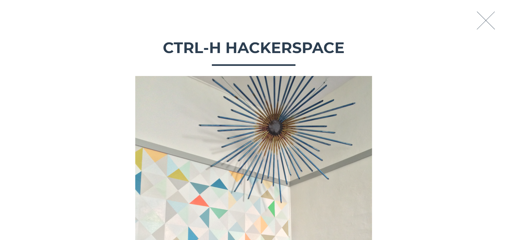
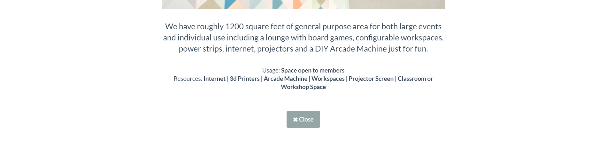
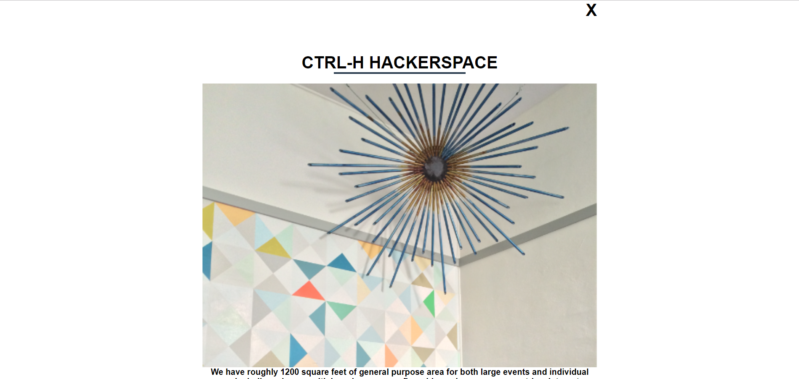

# NgClone
> _A project using Angular to clone a website_

#### By **Travis Toal**

### Installation / Usage
* _Find live site [here](https://hackerspace-123.firebaseapp.com/)_

* _Clone this repository to your machine, and run 'npm install' to download the dependencies._
* _Using your own firebase API key, create the following api-keys.ts file, located at the top level of src/app:_
```javascript
export const masterFirebaseConfig = {
  apiKey: YOUR_API_KEY,
  authDomain: "hackerspace-123.firebaseapp.com",
  databaseURL: "https://hackerspace-123.firebaseio.com",
  projectId: "hackerspace-123",
  storageBucket: "hackerspace-123.appspot.com",
  messagingSenderId: "802981317493"
}
```
* _Run 'ng serve' to build the server, on localhost:4200._
* _Navigate in your preferred browser to localhost:4200 to view the code in action_
* _Open the project in your preferred text editor to change the code._

## Planning

1. Dependencies
  * Hundreds of dependencies, standard for Angular download.

2. Configuration
  * Set up project as behavior-driven, logic-separated directory
  * Follow a 'Data Down, Action Up' methodology

3. Specs

| **Site should contain PDX Hackerspace's elements and look similar** |
| **Separate sections are created as separate components** |
| **Site contains a grid of pictures with info showing on hover, and modal showing on click** |
| **Modal page shows info, picture, restrictions, resources** |
| **Link div turns to dropdown button at certain width - media query** |
| **Site communicates with Firebase to access data** |
| **Site uses routing to open modals** |
| **Site is deployed live on firebase** |

4. UX/UI

## Original Site





## Result





## Future Desired Features
* _Potential API calls to social media_
* _Component allowing easier navigation by clicking on a section name from a dropdown menu_

## Technologies Used

* _Angular CLI v1.6.5_

* _Node v10.15.3_

* _Angular v5.2.11_

* _Typescript v2.5.3_

* _Webpack v3.10.0_

### Known Bugs

* _No known bugs as of 3/29/19_

### Support and Contact Details

_WARNING - mailto link:_

[Email me for any questions](mailto:travisty12@gmail.com)

[View my work on GitHub](https://www.github.com/travisty12/)

#### License
* _This software is licensed under the MIT license_

Copyright (c) 2019 **Travis Toal**
